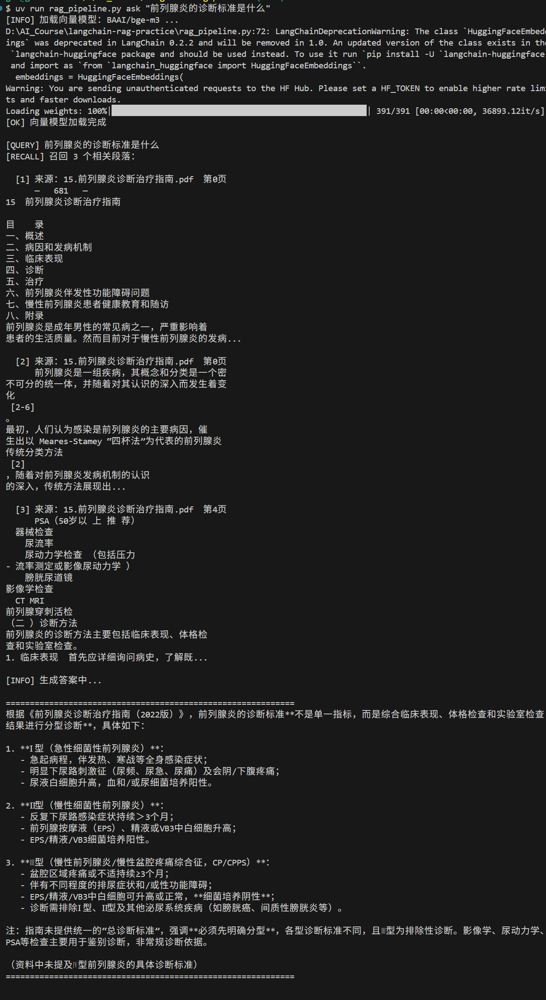
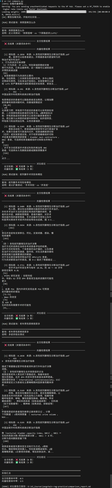

# LangChain RAG 完整链路实践

> 基于 pgvector + bge-m3 + 千问的医疗文档语义检索系统

## 为什么做这个项目？

在家医助手产品中，文档检索依赖 **全文索引（关键词匹配）**，存在明显局限：

| 问题         | 举例                                               |
| ------------ | -------------------------------------------------- |
| 语义理解弱   | 搜"血糖控制不好"，召不回"糖化血红蛋白偏高"相关内容 |
| 近义词不识别 | 搜"排尿困难"，无法匹配"下尿路症状（LUTS）"         |
| 跨段落关联差 | 问题和答案分布在不同段落时检索失败                 |

本项目用 **向量检索（RAG）** 替代全文索引，验证语义理解能力的提升效果。

---

## 技术架构

```
PDF 文档
    ↓ PyPDFLoader
文档切块（RecursiveCharacterTextSplitter, 500/50）
    ↓ HuggingFaceEmbeddings
bge-m3 向量化（本地运行，中文优化）
    ↓ PGVector
PostgreSQL + pgvector 存储
    ↓ 余弦相似度检索
Top-K 召回（默认 k=3，阈值 0.3）
    ↓ Prompt 拼接
千问 API（qwen-plus）生成最终答案
```

## 技术栈

| 组件        | 选型                  | 版本          |
| ----------- | --------------------- | ------------- |
| 编排框架    | LangChain             | 1.2.17        |
| 向量数据库  | PostgreSQL + pgvector | 17.7 + 0.8.2  |
| 向量化模型  | BAAI/bge-m3           | 本地缓存      |
| 生成模型    | 千问 qwen-plus        | DashScope API |
| Python 管理 | uv                    | 0.9.1         |

---

## 快速开始

### 1. 环境要求

- Windows / Linux / macOS
- Python 3.11+（通过 uv 管理）
- PostgreSQL 17 + pgvector 插件

### 2. 安装依赖

```bash
# 克隆项目
git clone https://github.com/guozhiwei01/langchain-rag-practice.git
cd langchain-rag-practice

# 安装所有依赖（uv 自动创建虚拟环境）
uv sync
```

### 3. 配置环境变量

```bash
cp .env.example .env
```

编辑 `.env`：

```env
PG_HOST=127.0.0.1
PG_PORT=5432
PG_USER=postgres
PG_PASSWORD=your_password
PG_DATABASE=rag_practice

DASHSCOPE_API_KEY=sk-xxxxxxxxxxxxxxxx
QWEN_MODEL=qwen-plus

BGE_MODEL_NAME=BAAI/bge-m3
```

### 4. 准备数据库

```sql
-- 在 PostgreSQL 中执行
CREATE DATABASE rag_practice;
\c rag_practice
CREATE EXTENSION vector;
```

### 5. 把 PDF 放入 pdf/ 目录

```
pdf/
├── 你的文档1.pdf
└── 你的文档2.pdf
```

### 6. 建立向量索引（首次运行）

```bash
uv run rag_pipeline.py ingest
```

输出示例：

```
[INFO] 找到 3 个 PDF 文件
[OK] 共加载 77 页文档
[OK] 切块完成：537 个 chunks（chunk_size=500, overlap=50）
[INFO] 加载向量模型：BAAI/bge-m3 ...
[OK] 向量模型加载完成
[OK] 已将 537 个 chunks 写入 pgvector
[DONE] 索引构建完成！
```

### 7. 开始问答

```bash
uv run rag_pipeline.py ask "前列腺炎的诊断标准是什么"
```

---

## 效果演示

### 问：前列腺炎的诊断标准是什么？

**召回段落（Top-3）：**

- 来源：`15.前列腺炎诊断治疗指南.pdf` 第0页（概述和分类）
- 来源：`15.前列腺炎诊断治疗指南.pdf` 第0页（Meares-Stamey 四杯法）
- 来源：`15.前列腺炎诊断治疗指南.pdf` 第4页（诊断方法）

**千问生成答案：**



> 根据《前列腺炎诊断治疗指南（2022版）》，诊断标准按分型如下：
>
> - **Ⅰ型（急性细菌性）**：急起发热、尿路刺激征、细菌培养阳性
> - **Ⅱ型（慢性细菌性）**：反复尿路感染 >3个月、EPS细菌培养阳性
> - **Ⅲ型（CP/CPPS）**：盆腔疼痛 ≥3个月、排除其他疾病、细菌培养阴性

---

## 项目结构

```
langchain-rag-practice/
├── rag_pipeline.py      # 核心链路（加载→切块→向量化→检索→生成）
├── pdf/                 # 原始 PDF 文档目录
│   ├── 15.前列腺炎诊断治疗指南.pdf
│   ├── 9.良性前列腺增生诊断治疗指南.pdf
│   └── 良性前列腺增生症中西医结合...指南（2022版）.pdf
├── .env                 # 环境变量（不提交到 Git）
├── .env.example         # 环境变量模板
├── pyproject.toml       # uv 项目配置
└── README.md
```

---

## 核心代码说明

### 文档切块策略

```python
RecursiveCharacterTextSplitter(
    chunk_size=500,      # 每块最多500字符
    chunk_overlap=50,    # 相邻块重叠50字符，保留上下文
    separators=["\\n\\n", "\\n", "。", "；", "，", " ", ""],
)
```

中文文档优先按段落、句子切分，保证语义完整性。

### 相似度检索

```python
retriever = vectorstore.as_retriever(
    search_type="similarity_score_threshold",
    search_kwargs={"k": 3, "score_threshold": 0.3},
)
```

使用余弦相似度，过滤掉相似度低于 0.3 的噪声结果。

---

## 对比：全文索引 vs 向量检索



| 场景                             | 全文索引  | 向量检索（本项目）  |
| -------------------------------- | --------- | ------------------- |
| 搜"排尿困难"→ 找"LUTS"          | ❌ 无结果 | ✅ 语义匹配         |
| 搜"手术风险"→ 找"并发症"        | ❌ 无结果 | ✅ 语义匹配         |
| 搜"老年尿频夜尿多"→ 找BPH夜尿症 | ❌ 无结果 | ✅ 语义匹配         |
| 精确关键词匹配                   | ✅ 快且准 | ✅ 也能匹配         |
| 索引构建速度                     | ✅ 极快   | ⏳ 需要向量化       |
| 部署复杂度                       | 低        | 中（需要 pgvector） |

**实测结论：全文检索命中率 0/3（0%），向量检索命中率 3/3（100%）**

---

## TODO

- [ ] 加相似度阈值动态调整
- [ ] 支持多轮对话历史
- [ ] Query Rewrite（查询改写）提升召回质量
- [x] 对比实验截图
- [ ] Web UI 界面

---

## 作者

郭志伟 | 家庭医生助手 AI 工程师
项目背景：家医助手全文索引局限性验证与向量检索替代方案
