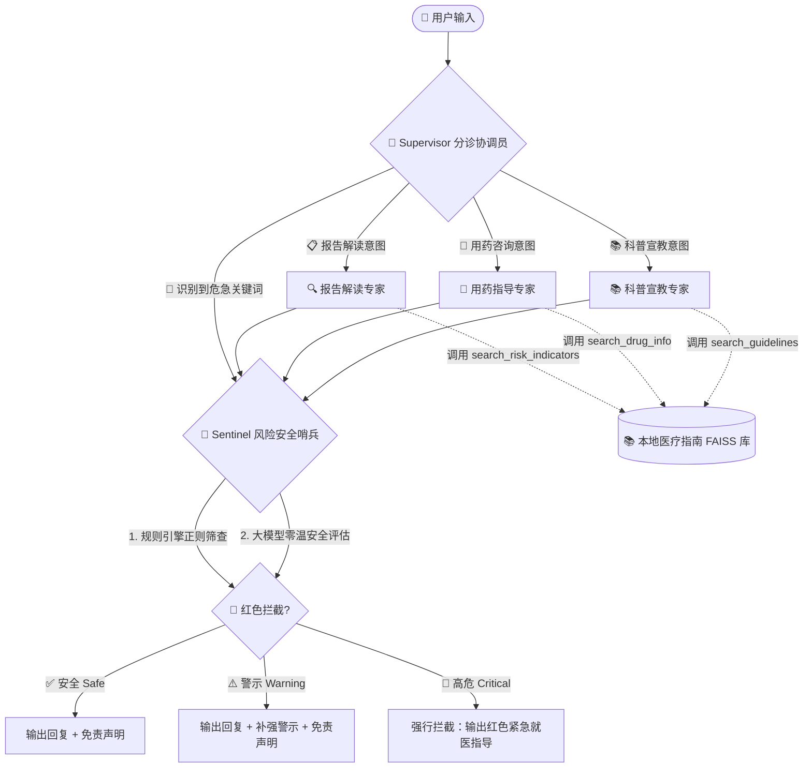

# 🏥 医疗多智能体临床指导系统 - 架构设计文档

> 基于 `langchain-core` + `langchain-openai` + `langgraph` + `FAISS` + `DashScope` + `Langfuse`

---

## 📁 项目目录结构

```
langchain-rag-practice/
├── multi_agent/                    # 多智能体系统（核心模块）
│   ├── __init__.py
│   ├── config.py                   # 统一配置：LLM / Embedding / FAISS / Langfuse
│   ├── state.py                    # 共享状态定义 (MultiAgentState)
│   ├── tools.py                    # RAG 检索工具（3 个专业医疗检索器）
│   ├── graph.py                    # LangGraph StateGraph 编排与编译
│   ├── main.py                     # CLI 入口（ask / demo）
│   ├── agents/                     # 5 个专业智能体
│   │   ├── supervisor.py           # 分诊协调员（意图分类 + 危急旁路）
│   │   ├── report_interpreter.py   # AI 评估报告解读专家
│   │   ├── medication_guide.py     # AI 用药指导专家
│   │   ├── health_educator.py      # AI 科普宣教专家
│   │   └── risk_sentinel.py        # AI 风险预警哨兵（规则引擎 + LLM 双重审计）
│   └── faiss_index/                # 本地 FAISS 向量索引（自动生成）
│       ├── index.faiss
│       └── index.pkl
├── pdf/                            # 医疗指南 PDF 原始文件
│   ├── 15.前列腺炎诊断治疗指南.pdf
│   ├── 9.良性前列腺增生诊断治疗指南.pdf
│   └── 良性前列腺增生症中西医结合...诊疗指南（2022版）.pdf
├── rag_pipeline.py                 # 原始单智能体 RAG 管道（保留不动）
├── docs/                           # 架构文档
│   └── architecture.md             # 本文件
├── .env                            # 环境变量（API Keys，已 gitignore）
├── .env.example                    # 环境变量模板
└── pyproject.toml                  # 项目依赖声明
```

---

## 🏗️ 技术栈

| 层级 | 技术 | 说明 |
|------|------|------|
| **大语言模型** | 阿里 Qwen（qwen-plus） | 通过 DashScope OpenAI 兼容接口调用 |
| **Agent 编排** | LangGraph StateGraph | 状态机驱动的多智能体工作流图 |
| **Agent 框架** | langchain-core + langchain-openai | Runnable 协议、Tool 绑定、消息体系 |
| **向量检索** | FAISS（本地文件） | 零数据库依赖，自动解析 PDF 构建索引 |
| **文本嵌入** | DashScope text-embedding-v2 | 在线 API，分批请求（每批 ≤25） |
| **可观测性** | Langfuse v4 | LLM 链路追踪、Token 统计、延迟分析 |
| **PDF 解析** | PyPDFLoader + RecursiveCharacterTextSplitter | chunk_size=500, chunk_overlap=50 |

---

## 🗺️ 系统架构拓扑

整个系统由 **5 个专业医疗 Agent** + **1 个统一状态机** 组成，基于**双重安全阀**（分诊安全阀 + 哨兵安全阀）构筑临床安全保障体系：



---

## 🔐 双重安全审计机制

### 第一道防线：Supervisor 分诊安全阀

Supervisor 在意图分类前，先用关键词匹配检测是否存在危急症状描述（如「无法排尿」「大量出血」「意识模糊」等）。若命中，**直接旁路所有专科 Agent，一键直达 Sentinel 哨兵**，最大限度缩短危急响应延迟。

### 第二道防线：Sentinel 风险哨兵

采用**规则引擎 + LLM 双重审计**：

| 防线 | 机制 | 优势 |
|------|------|------|
| **规则引擎（优先）** | 正则匹配危急症状和危急指标值 | 快速、可靠、不依赖 LLM、零幻觉 |
| **LLM 审计（兜底）** | 零温度大模型评估回答安全性 | 覆盖规则遗漏的语义级风险 |

风险等级输出：

| 等级 | 处理 |
|------|------|
| `✅ Safe` | 原回复通过 + 追加标准免责声明 |
| `⚠️ Warning` | 原回复 + 补充安全提醒 + 免责声明 |
| `🚨 Critical` | **强行拦截原回复**，替换为红色紧急就医指导 |

---

## 🧩 五大 Agent 职责

### 1. Supervisor 分诊协调员
- **职责**：接收用户输入，进行意图分类，路由到对应的专科 Agent
- **工具**：无（纯 LLM 推理）
- **安全机制**：危急关键词直接旁路至 Sentinel

### 2. Report Interpreter 报告解读专家
- **职责**：解读医学检查指标（PSA、IPSS 等），给出专业分析
- **工具**：`search_risk_indicators` → FAISS 检索

### 3. Medication Guide 用药指导专家
- **职责**：药物用法用量、副作用、联合用药注意事项
- **工具**：`search_drug_info` → FAISS 检索

### 4. Health Educator 科普宣教专家
- **职责**：疾病科普、生活饮食建议、心理疏导
- **工具**：`search_guidelines` → FAISS 检索

### 5. Risk Sentinel 风险预警哨兵
- **职责**：安全审计，拥有一票否决权
- **工具**：规则引擎 + LLM 零温审计

---

## ⚙️ 环境配置

### .env 必需变量

```bash
# 阿里 DashScope API（必填）
DASHSCOPE_API_KEY=sk-xxxxx
QWEN_MODEL=qwen-plus

# Langfuse 可观测性（选填，未配置时自动跳过）
LANGFUSE_PUBLIC_KEY=pk-lf-xxxxx
LANGFUSE_SECRET_KEY=sk-lf-xxxxx
LANGFUSE_HOST=https://us.cloud.langfuse.com  # 生产环境改为内网地址
```

### 运行命令

```bash
# 单次问答
.venv/bin/python -m multi_agent.main ask "你的医疗问题"

# 四场景端到端演示
.venv/bin/python -m multi_agent.main demo
```

---

## 📊 四场景验证结果

| 场景 | 测试问题 | 路由链路 | 风险等级 |
|------|---------|---------|---------|
| AI 评估报告解读 | PSA 5.2 ng/mL 严重吗？ | Supervisor → Interpreter → Sentinel | ✅ 安全 |
| AI 用药指导 | 非那雄胺和坦索罗辛怎么吃？ | Supervisor → Medication → Sentinel | 🚨 高危（规则引擎拦截） |
| AI 科普宣教 | 前列腺增生饮食注意什么？ | Supervisor → Educator → Sentinel | ✅ 安全 |
| AI 风险预警 | 完全无法排尿 6 小时 | Supervisor → **直达 Sentinel** | 🚨 高危（双重拦截） |

---

## 🏭 生产部署注意事项

1. **Langfuse 私有化**：Docker 部署 Langfuse，`.env` 中 `LANGFUSE_HOST` 改为内网地址，代码零改动
2. **向量库升级**：数据量大时可从 FAISS 切换至 PGVector，仅需修改 `config.py` 中 `get_vectorstore()`
3. **PDF 扩展**：新增指南文件放入 `pdf/` 目录，删除 `multi_agent/faiss_index/` 后重新运行即可自动重建索引
4. **安全规则扩展**：在 `risk_sentinel.py` 的 `CRITICAL_PATTERNS` 列表中添加新的正则模式
