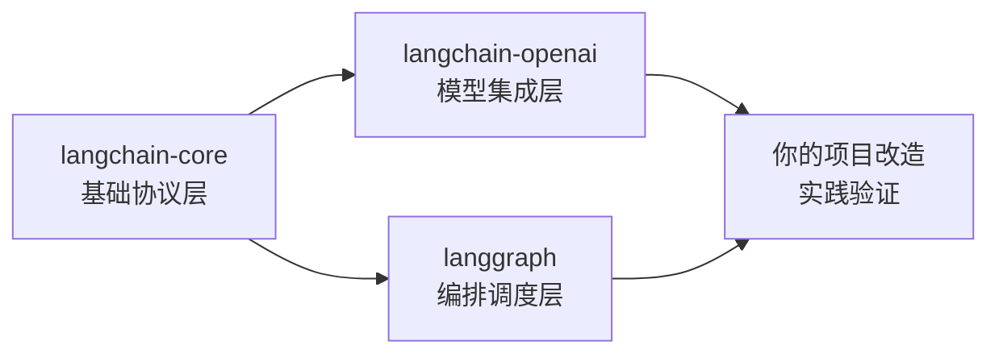
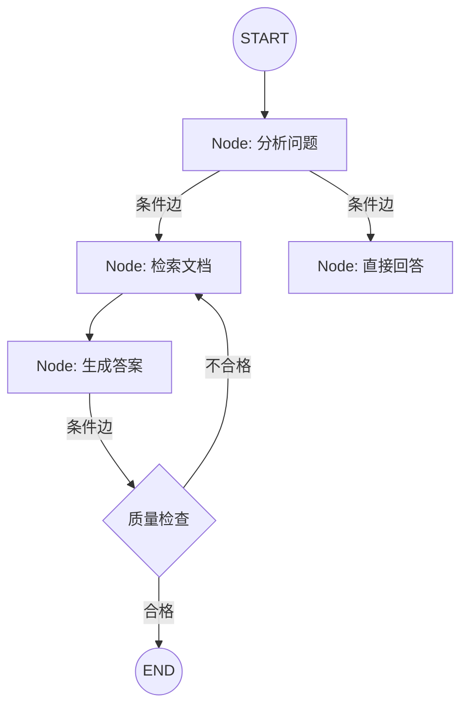
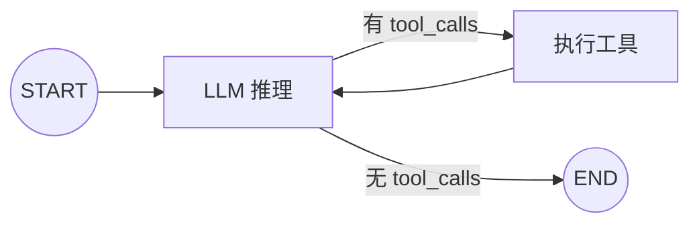

# 🎯 LangChain 深度学习面试指南

> 基于你的 `langchain-rag-practice` 项目，深入理解 **langchain-core** / **langchain-openai** / **langgraph** 的原理

---

## 📋 学习路线总览



| 模块 | 核心要学的 | 面试考点 |
|------|-----------|---------|
| **langchain-core** | Runnable 协议、LCEL 管道、PromptTemplate、OutputParser | `invoke/stream/batch` 统一接口、`|` 管道原理、序列化 |
| **langchain-openai** | ChatOpenAI、bind_tools、function calling、RunnableBinding | 模型抽象层、Tool 调用链路、与原生 OpenAI SDK 的区别 |
| **langgraph** | StateGraph、Node/Edge、条件路由、Checkpointer、ReAct Agent | 有环图 vs 无环链、状态管理、Agent 循环机制 |

---

## 模块一：langchain-core 原理剖析

### 1.1 Runnable 协议 — 万物皆 Runnable

> [!IMPORTANT]
> **面试核心问题：LangChain 的 Runnable 协议是什么？为什么需要它？**

**原理：** `Runnable` 是一个抽象基类，定义了所有 LangChain 组件的统一接口。无论是 PromptTemplate、LLM、Retriever 还是 OutputParser，都实现了同一套方法：

```python
class Runnable(ABC):
    def invoke(self, input, config=None) -> Output:       # 单条同步调用
        ...
    async def ainvoke(self, input, config=None) -> Output: # 单条异步调用
        ...
    def batch(self, inputs, config=None) -> list[Output]:  # 批量调用
        ...
    def stream(self, input, config=None) -> Iterator:      # 流式输出
        ...
```

**为什么需要？** 统一接口让所有组件可以像乐高一样自由组合。你不需要关心每个组件内部怎么实现，只需要知道它接收什么、输出什么。

#### 你的项目中的体现

在你的 [rag_pipeline.py](file:///Users/guozhiwei/Desktop/project/langchain-rag-practice/rag_pipeline.py#L110-L116) 中：

```python
# retriever 就是一个 Runnable
retriever = vectorstore.as_retriever(
    search_type="similarity_score_threshold",
    search_kwargs={"k": k, "score_threshold": score_threshold},
)
results = retriever.invoke(query)  # ← 统一的 invoke 接口
```

### 1.2 LCEL 管道（`|` 操作符）— 链式组合的秘密

> [!IMPORTANT]
> **面试核心问题：LCEL 的 `|` 操作符底层是怎么实现的？**

**原理：** `|` 是 Python 的 `__or__` 魔术方法。当你写 `A | B` 时，实际上调用了 `A.__or__(B)`，返回一个 `RunnableSequence` 对象。

```python
# 源码简化版
class Runnable:
    def __or__(self, other):
        return RunnableSequence(first=self, last=other)

class RunnableSequence(Runnable):
    def invoke(self, input, config=None):
        result = input
        for step in self.steps:
            result = step.invoke(result, config)  # 前一步的输出是后一步的输入
        return result
```

**关键 Runnable 原语：**

| 原语 | 作用 | 典型场景 |
|------|------|---------|
| `RunnableSequence` | 顺序执行 A→B→C | `prompt | llm | parser` |
| `RunnableParallel` | 并行执行，合并为 dict | `{"context": retriever, "question": passthrough}` |
| `RunnablePassthrough` | 原样传递输入 | RAG 中保留原始 query |
| `RunnableLambda` | 包装普通函数为 Runnable | 自定义处理逻辑 |
| `RunnableBranch` | 条件分支 | 根据输入走不同链路 |

### 1.3 PromptTemplate — 不只是字符串格式化

**原理：** `PromptTemplate` 也是一个 `Runnable`，它的 `invoke()` 接收一个 dict，输出一个 `PromptValue`（可以转为 string 或 messages）。

```python
from langchain_core.prompts import ChatPromptTemplate

# 这不是简单的 f-string，而是一个 Runnable
prompt = ChatPromptTemplate.from_messages([
    ("system", "你是医学助手，根据参考资料回答"),
    ("human", "参考资料：{context}\n\n问题：{question}")
])

# prompt.invoke({"context": "...", "question": "..."}) 返回 ChatPromptValue
```

**面试加分点：** 对比你项目中的手动拼接 prompt（第131-139行）和 LCEL 方式的区别——LCEL 方式支持自动 streaming、tracing、序列化。

### 1.4 OutputParser — 结构化输出

```python
from langchain_core.output_parsers import StrOutputParser, JsonOutputParser

# StrOutputParser: AIMessage → str
# JsonOutputParser: AIMessage → dict (自动解析JSON)
# PydanticOutputParser: AIMessage → Pydantic Model (带校验)
```

---

## 模块二：langchain-openai 原理剖析

### 2.1 ChatOpenAI — 模型抽象层

> [!IMPORTANT]
> **面试核心问题：ChatOpenAI 和直接用 openai SDK 有什么区别？**

**答案要点：**

| 维度 | 原生 OpenAI SDK | ChatOpenAI (langchain-openai) |
|------|----------------|-------------------------------|
| 接口 | `client.chat.completions.create()` | `model.invoke()` / `stream()` / `batch()` |
| 输出 | OpenAI 私有格式 | 统一的 `AIMessage` 对象 |
| 组合性 | 不能用 `\|` 管道 | 是 Runnable，可以自由组合 |
| Tool Calling | 手动构造 JSON Schema | `bind_tools()` 自动转换 |
| 可替换性 | 绑定 OpenAI | 换模型只需换一行代码 |

**你的项目对比：** 你在 `generate_answer()` 中直接用了原生 `openai.OpenAI`：

```python
# 你的当前写法（原生 SDK）
from openai import OpenAI
client = OpenAI(api_key=..., base_url=...)
response = client.chat.completions.create(model=..., messages=[...])
```

```python
# langchain-openai 写法（Runnable 协议）
from langchain_openai import ChatOpenAI
llm = ChatOpenAI(model="qwen-plus", api_key=..., base_url=...)
response = llm.invoke([HumanMessage(content=prompt)])  # 返回 AIMessage
```

### 2.2 bind_tools — Function Calling 的关键

> [!IMPORTANT]
> **面试核心问题：`bind_tools()` 的底层机制是什么？**

**原理：** `bind_tools()` 不会立即发送 API 请求。它返回一个 `RunnableBinding`，把 tool 定义"绑定"到模型的调用参数中。

```python
# 执行流程：
# 1. 定义 tool
@tool
def search_medical_db(query: str) -> str:
    """搜索医疗数据库"""
    return retriever.invoke(query)

# 2. bind_tools → 返回 RunnableBinding（不发请求）
llm_with_tools = llm.bind_tools([search_medical_db])
# 内部：将 @tool 的函数签名 → OpenAI function calling JSON Schema

# 3. invoke 时才真正发请求
response = llm_with_tools.invoke(messages)
# 如果模型决定调用 tool，response.tool_calls 会有内容
```

**`RunnableBinding` 的本质：**
```python
class RunnableBinding(Runnable):
    bound: Runnable          # 原始模型
    kwargs: dict             # 绑定的额外参数（如 tools）
    
    def invoke(self, input, config=None):
        return self.bound.invoke(input, config, **self.kwargs)
```

### 2.3 消息类型体系

```python
from langchain_core.messages import (
    SystemMessage,    # 系统指令
    HumanMessage,     # 用户输入
    AIMessage,        # 模型回复（可能包含 tool_calls）
    ToolMessage,      # 工具执行结果（返回给模型）
)
```

**面试关键：** `AIMessage.tool_calls` 是 LangChain 统一的 tool call 格式，与 OpenAI 原生的 `function_call` 格式解耦，所以换模型提供商不需要改代码。

---

## 模块三：LangGraph 原理剖析

### 3.1 为什么需要 LangGraph？

> [!IMPORTANT]
> **面试核心问题：LangChain 的 Chain 和 LangGraph 有什么区别？**

| 维度 | LangChain Chain (LCEL) | LangGraph |
|------|----------------------|-----------|
| 拓扑 | DAG（有向无环图）| 支持**有环图**（循环） |
| 状态 | 无状态，数据流过即丢 | **有状态**，共享 State |
| 控制流 | 线性/简单分支 | 条件路由、循环、中断 |
| 适用场景 | 简单 RAG 管道 | Agent、多轮决策、复杂工作流 |

**一句话总结：** Chain 是流水线（A→B→C），LangGraph 是状态机（可以 A→B→A 循环）。

### 3.2 StateGraph 核心三要素



#### ① State（状态）

```python
from typing import TypedDict, Annotated
from langgraph.graph import add_messages

class RAGState(TypedDict):
    messages: Annotated[list, add_messages]  # add_messages 是 reducer
    query: str
    documents: list
    answer: str
```

> [!NOTE]
> **Reducer 机制**：`Annotated[list, add_messages]` 表示当多个节点更新 `messages` 时，用 `add_messages` 函数合并（追加），而不是覆盖。这是 LangGraph 状态管理的核心设计。

#### ② Node（节点）

```python
def retrieve_node(state: RAGState) -> dict:
    """节点是普通 Python 函数，接收 state，返回 partial update"""
    query = state["query"]
    docs = retriever.invoke(query)
    return {"documents": docs}  # 只返回要更新的字段
```

#### ③ Edge（边）

```python
from langgraph.graph import StateGraph, START, END

graph = StateGraph(RAGState)
graph.add_node("retrieve", retrieve_node)
graph.add_node("generate", generate_node)

# 普通边：固定路由
graph.add_edge(START, "retrieve")
graph.add_edge("retrieve", "generate")

# 条件边：动态路由（关键！）
graph.add_conditional_edges(
    "generate",
    quality_check,  # 路由函数：检查 state，返回下一个节点名
    {"retry": "retrieve", "done": END}
)
```

### 3.3 ReAct Agent 循环 — LangGraph 最经典的模式

> [!IMPORTANT]
> **面试核心问题：ReAct Agent 的循环是怎么实现的？**



**原理：**
1. LLM 节点：接收消息，调用带 tools 的模型
2. 条件边：检查 `AIMessage.tool_calls` 是否为空
   - 非空 → 走 tools 节点
   - 为空 → 结束
3. Tools 节点：执行 tool，把结果作为 `ToolMessage` 加入 state
4. 回到 LLM 节点（**这就是循环/环**）

```python
from langgraph.prebuilt import create_react_agent

# 一行代码创建 ReAct Agent
agent = create_react_agent(model=llm, tools=[search_tool, calc_tool])
```

### 3.4 Checkpointer — 持久化与记忆

```python
from langgraph.checkpoint.memory import MemorySaver

checkpointer = MemorySaver()  # 开发用内存版；生产用 PostgresSaver
agent = create_react_agent(model, tools, checkpointer=checkpointer)

# 同一个 thread_id 的对话自动保留历史
config = {"configurable": {"thread_id": "user-001"}}
agent.invoke({"messages": [("human", "你好")]}, config)
agent.invoke({"messages": [("human", "我刚才说了什么?")]}, config)  # 记得上下文
```

---

## 🔥 面试高频问题与答案

### Q1: LCEL 的 `|` 操作符底层做了什么？

**答：** `|` 触发 `Runnable.__or__()`, 返回 `RunnableSequence`。`RunnableSequence.invoke()` 会按顺序执行每个 step, 把前一步的 output 作为下一步的 input。它还自动提供了 `stream()`（流式传递 last step 的输出）和 `batch()`（对每个 input 执行完整 pipeline）。

### Q2: LangChain 的 Retriever 是什么？和 VectorStore 的关系？

**答：** `VectorStore` 负责存储和搜索向量。`Retriever` 是一个 `Runnable`，它包装了 VectorStore 的搜索方法，提供 `invoke(query) → List[Document]` 的统一接口。`vectorstore.as_retriever()` 就是这个转换过程。Retriever 还支持 `search_type`（similarity、mmr、similarity_score_threshold）等参数。

### Q3: 为什么用 LangGraph 而不是 LCEL Chain 来做 Agent？

**答：** LCEL 是 DAG（有向无环图），不支持循环。但 Agent 的核心是 **推理-行动循环**（ReAct loop）: LLM 推理 → 调用工具 → 把结果反馈给 LLM → 再推理...这需要**有环图**。LangGraph 的 `StateGraph` 支持环，加上条件边和共享状态，天然适合 Agent 场景。

### Q4: LangGraph 的 State Reducer 是什么？

**答：** 当多个节点都要更新同一个 state 字段时，Reducer 定义合并策略。例如 `Annotated[list, add_messages]` 表示用 `add_messages` 函数追加消息，而不是覆盖。如果不指定 reducer，默认行为是覆盖。

### Q5: ChatOpenAI 的 bind_tools 和直接传 tools 参数有什么区别？

**答：** `bind_tools()` 返回一个 `RunnableBinding`，它是一个新的 Runnable，把 tool 定义"冻结"在配置中。好处是：（1）可以在 LCEL 管道中组合使用 （2）延迟执行，invoke 时才真正构造 API 请求 （3）自动将 Python 函数/Pydantic 模型转换为 OpenAI JSON Schema 格式。

### Q6: RAG 中 chunk_size 和 chunk_overlap 怎么调？

**答：** chunk_size 太大会引入噪声（无关内容稀释相关内容），太小会丢失上下文。通常 300-1000 字符。chunk_overlap 保证切分边界不会切断关键信息，一般设为 chunk_size 的 10-20%。你的项目用 500/50 是合理的。还要根据 embedding 模型的 max_seq_length 来设置上限。

### Q7: 如何评估 RAG 系统的效果？

**答：** 用 RAGAS 等框架，核心指标：
- **Faithfulness**（忠实度）：答案是否忠于检索到的文档
- **Answer Relevance**（答案相关性）：答案是否回答了问题
- **Context Precision**（上下文精确度）：检索到的文档是否相关
- **Context Recall**（上下文召回率）：是否检索到了足够的相关文档

---

## 🛠 实践路线：改造你的项目

我为你的项目创建了 3 个渐进式实践文件：

### Step 1: `01_lcel_rag_chain.py` — 用 LCEL 重构 RAG 管道
> 把你的手动拼接 prompt + 原生 OpenAI 调用 改为 LCEL 链式管道

### Step 2: `02_tool_calling.py` — 实现 Tool Calling
> 用 `ChatOpenAI.bind_tools()` 让模型自主决定是否需要检索

### Step 3: `03_langgraph_agent.py` — 构建 LangGraph RAG Agent
> 用 StateGraph 实现一个带循环、条件路由、质量检查的 RAG Agent

每个文件都有详细的注释说明原理，建议按顺序实践。
